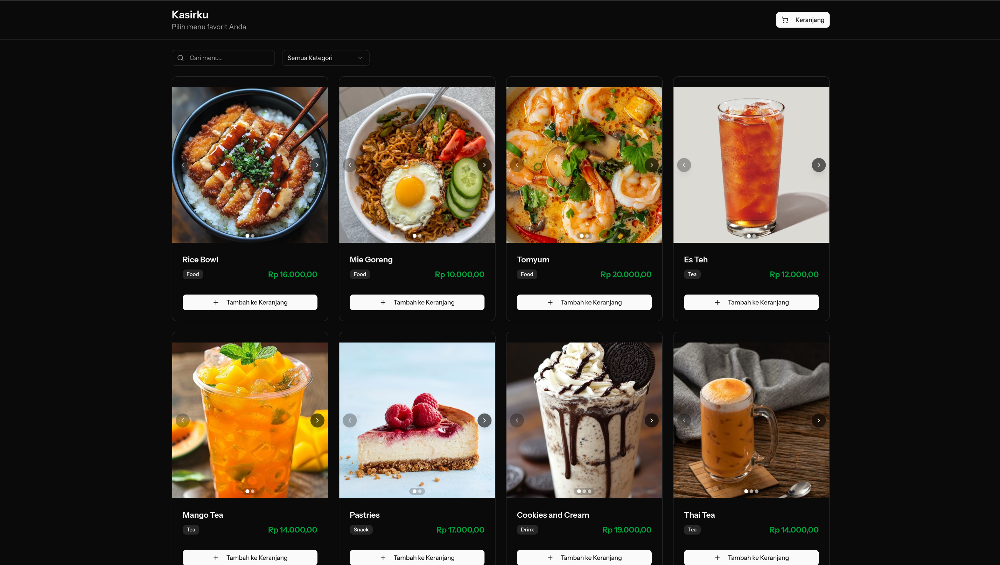
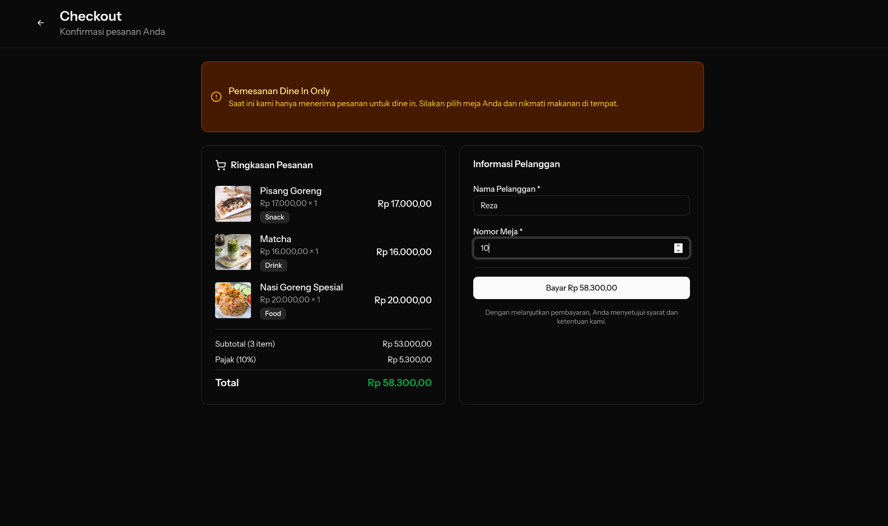
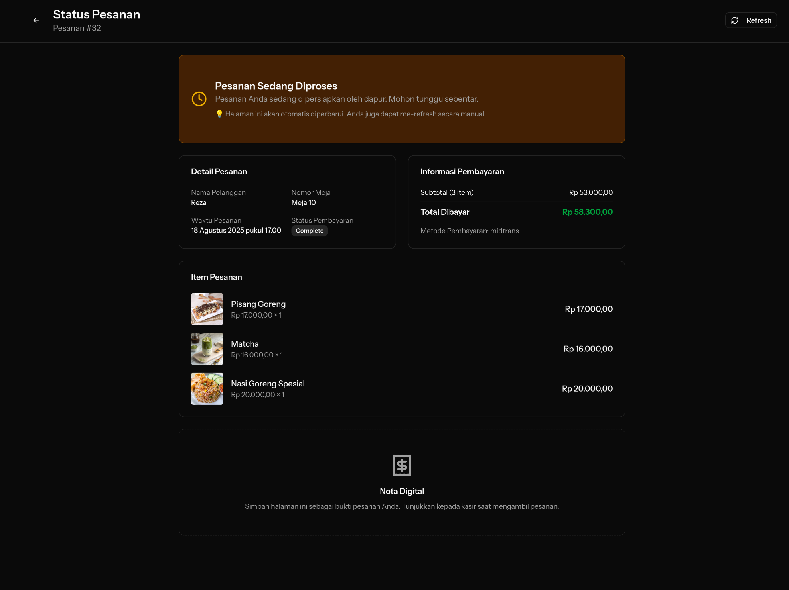
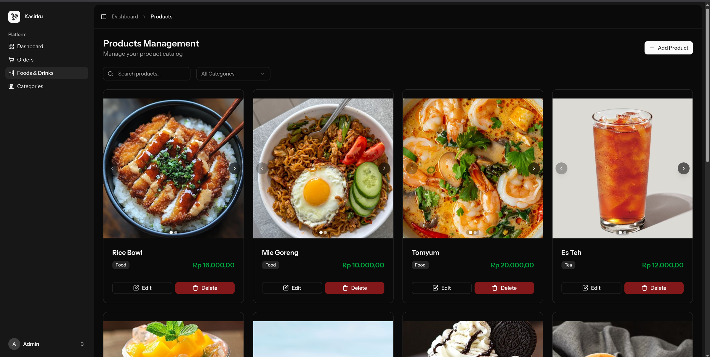

# 🍽️ Kasirku - Point of Sale (POS) System

**Kasirku** is a modern Point of Sale (POS) system specifically designed for restaurants and cafes. Built with cutting-edge web technologies to provide a seamless experience for both customers and administrators.


## ✨ Key Features

### 🛍️ Customer Interface

- **Digital Menu**: Interactive product catalog with photos and descriptions
- **Smart Cart**: Shopping cart with persistent storage
- **Advanced Search & Filter**: Product search by name and category
- **Infinite Scroll**: Automatic product loading on scroll
- **Mobile Responsive**: Optimized for all devices

### 💳 Payment System

- **Midtrans Integration**: Trusted payment gateway for Indonesia
- **Multiple Payment Methods**: Support for various digital payment methods
- **Tax Calculation**: Automatic 10% tax calculation with clear breakdown
- **Real-time Status**: Real-time payment status updates
- **Payment Webhook**: Automatic notifications from payment gateway

### 📱 Order Management

- **Real-time Order Tracking**: Customers can track order status
- **Order Status Updates**: Pending → Completed → Ready for pickup
- **Digital Receipt**: Digital receipt that customers can save
- **Table Management**: Table number system for dine-in orders

### 🔧 Admin Dashboard

- **Product Management**: CRUD operations for products with multi-photo upload
- **Category Management**: Product organization by categories
- **Order Management**: Monitor and update order status
- **Payment Tracking**: Monitor payments and reconciliation
- **Receipt Printing**: Print thermal receipts for customers

### 🖨️ Printing System

- **Thermal Printer Support**: Integration with ESC/POS thermal printers
- **Custom Receipt Format**: Customizable receipt layout
- **Auto Print**: Automatic printing after order completion

## 📸 Screenshots

### Customer Interface

<div align="center">
  
  
  
</div>

_Digital menu with product catalog, checkout page with tax calculation, and real-time order status tracking_

### Admin Dashboard

<div align="center">
  
</div>

_Admin products management dashboard for managing inventory and orders_

## 🏗️ Tech Stack

### Backend

- **Laravel 12.x** - PHP Framework
- **Inertia.js** - Modern monolith approach
- **SQLite Database** - Lightweight database solution
- **Midtrans SDK** - Payment gateway integration
- **ESC/POS PHP** - Thermal printer integration

### Frontend

- **React 18** - User interface library
- **TypeScript** - Type-safe JavaScript
- **Tailwind CSS** - Utility-first CSS framework
- **shadcn/ui** - Modern UI components
- **Vite** - Fast build tool and dev server

### Development Tools

- **Composer** - PHP dependency management
- **NPM** - Node.js package management
- **Laravel Pint** - PHP code styling
- **ESLint & Prettier** - JavaScript/TypeScript linting and formatting
- **Pest** - PHP testing framework

## 🚀 Installation

### Prerequisites

- PHP 8.2 or higher
- Composer
- Node.js 18+ and NPM
- SQLite (or other Laravel-supported database)

### Step 1: Clone Repository

```bash
git clone https://github.com/rezadrian01/Kasirku.git
cd Kasirku
```

### Step 2: Install Dependencies

```bash
# Install PHP dependencies
composer install

# Install Node.js dependencies
npm install
```

### Step 3: Environment Setup

```bash
# Copy environment file
cp .env.example .env

# Generate application key
php artisan key:generate
```

### Step 4: Database Setup

```bash
# Run migrations
php artisan migrate

# Seed database (optional)
php artisan db:seed
```

### Step 5: Configure Midtrans

Edit the `.env` file and add Midtrans configuration:

```env
MIDTRANS_SERVER_KEY=your-server-key
MIDTRANS_CLIENT_KEY=your-client-key
MIDTRANS_IS_PRODUCTION=false
MIDTRANS_IS_SANITIZED=true
MIDTRANS_IS_3DS=true
```

### Step 6: Build Assets

```bash
# Development
npm run dev

# Production
npm run build
```

### Step 7: Start Development Server

```bash
# Laravel development server
php artisan serve

# Vite development server (in separate terminal)
npm run dev
```

The application will be available at `http://localhost:8000`

## 📖 Usage Guide

### Customer Flow

1. **Browse Menu**: Customers access the homepage to view the menu
2. **Add to Cart**: Select products and add them to the cart
3. **Checkout**: Enter customer name and table number
4. **Payment**: Pay using Midtrans payment gateway
5. **Order Tracking**: Track order status through the provided link

### Admin Flow

1. **Login**: Admin logs in to the dashboard (`/admin/dashboard`)
2. **Manage Products**: Add, edit, or delete products
3. **Manage Categories**: Manage product categories
4. **Monitor Orders**: View and update order status
5. **Print Receipt**: Print receipts for customers

## 🔧 Configuration

### Midtrans Setup

1. Register an account at [Midtrans](https://midtrans.com)
2. Get your Server Key and Client Key
3. Configure webhook URL for production: `yourdomain.com/checkout/notification`

### Printer Setup (Optional)

1. Connect thermal printer via USB
2. Ensure printer is detected at `/dev/usb/lp0`
3. Adjust printer path in `PrintController.php` if needed

### Environment Variables

```env
# Application
APP_NAME=Kasirku
APP_URL=http://localhost:8000

# Database
DB_CONNECTION=sqlite
DB_DATABASE=/absolute/path/to/database.sqlite

# Midtrans Configuration
MIDTRANS_SERVER_KEY=your-server-key
MIDTRANS_CLIENT_KEY=your-client-key
MIDTRANS_IS_PRODUCTION=false
```

## 🧪 Testing

```bash
# Run PHP tests
php artisan test

# Run with coverage
php artisan test --coverage

# Run JavaScript tests
npm run test

# Type checking
npm run types
```

## 📁 Project Structure

```
kasirku/
├── app/
│   ├── Http/Controllers/        # Laravel controllers
│   ├── Models/                  # Eloquent models
│   └── Providers/              # Service providers
├── database/
│   ├── migrations/             # Database migrations
│   ├── seeders/                # Database seeders
│   └── factories/              # Model factories
├── resources/
│   ├── js/                     # React/TypeScript frontend
│   │   ├── components/         # Reusable UI components
│   │   ├── pages/              # Page components
│   │   └── types/              # TypeScript type definitions
│   └── css/                    # Stylesheets
├── routes/
│   ├── web.php                 # Web routes
│   └── auth.php                # Authentication routes
└── public/                     # Public assets
```

## 🤝 Contributing

We warmly welcome contributions! Please follow these steps:

1. Fork this repository
2. Create a feature branch (`git checkout -b feature/amazing-feature`)
3. Commit your changes (`git commit -m 'Add amazing feature'`)
4. Push to the branch (`git push origin feature/amazing-feature`)
5. Create a Pull Request

### Development Guidelines

- Follow PSR-12 for PHP code
- Use TypeScript for all frontend code
- Ensure all tests pass before submitting PR
- Write descriptive commit messages

## 🐛 Bug Reports & Feature Requests

If you find a bug or want to request a new feature:

1. Check first in [Issues](https://github.com/rezadrian01/Kasirku/issues)
2. If it doesn't exist, create a new issue with the appropriate template
3. Provide detailed information and reproduction steps for bugs

## 📄 License

This project uses the [MIT License](LICENSE.md). You are free to use, modify, and distribute this project according to the license terms.

## 🙏 Acknowledgments

- [Laravel](https://laravel.com) - Amazing PHP framework
- [React](https://reactjs.org) - The best UI library
- [Tailwind CSS](https://tailwindcss.com) - Utility-first CSS framework
- [shadcn/ui](https://ui.shadcn.com) - Beautiful UI components
- [Midtrans](https://midtrans.com) - Indonesian payment gateway
- [Inertia.js](https://inertiajs.com) - Modern monolith approach

## 👨‍💻 Author

**Reza Adrian**

- GitHub: [@rezadrian01](https://github.com/rezadrian01)

## 📞 Support

If you need help or have questions:

- Create an issue in the GitHub repository
- Email: support@kasirku.com (if available)

---

⭐ Don't forget to star this repository if it's helpful!

**Made with ❤️ for Indonesian F&B industry**
